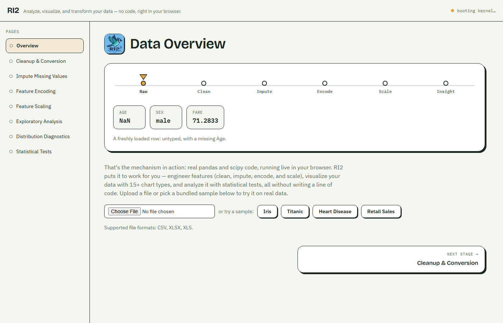

<p align="center">
  
</p>

<h1 align="center">RI2 — Rapid Insights Data Engine</h1>

<p align="center"><i>Analyze, visualize, and transform your data — no code, right in your browser.</i></p>

<p align="center">
  <a href="https://sudhanshumukherjeexx.github.io/ri2/"></a>
  <a href="https://github.com/sudhanshumukherjeexx/ri2/actions/workflows/deploy.yml"></a>
  <a href="LICENSE"></a>
  <a href="#contributing"></a>
</p>

<p align="center">
  <a href="https://sudhanshumukherjeexx.github.io/ri2/"><strong>▶ Try it live — sudhanshumukherjeexx.github.io/ri2</strong></a>
</p>

<p align="center">
  
</p>

## Contents

- [What is RI2](#what-is-ri2)
- [Features](#features)
- [Quick start](#quick-start)
- [How it works](#how-it-works)
- [Project structure](#project-structure)
- [AI Insight](#ai-insight)
- [Contributing](#contributing)
- [Why we moved off Streamlit](#why-we-moved-off-streamlit)
- [License](#license)

## What is RI2

RI2 is a no-code toolkit for cleaning, engineering, visualizing, and
statistically analyzing tabular data (CSV, XLSX, XLS). Upload a file or pick a
bundled sample and, without writing a line of code, you can go from a messy
raw file to a cleaned, feature-engineered, chart-explored, statistically
tested dataset — entirely in your browser tab.

There's no backend. Every transform is real pandas/numpy/scipy/scikit-learn
code, running as WebAssembly via [Pyodide](https://pyodide.org/) in a Web
Worker on your machine. Your data is never uploaded anywhere, and the whole
app deploys as static files to GitHub Pages.

## Features

- **Feature engineer** — fix column types, remove duplicates, impute missing
  values (8 strategies), encode categoricals, and scale/transform numeric
  features (8 methods)
- **Visualize** — 15+ chart types across basic, advanced, specialized, and
  geospatial categories
- **Analyze** — skewness/kurtosis, normality tests, IQR outlier detection, and
  6 hypothesis tests (t-test, ANOVA, chi-square, Mann-Whitney, Wilcoxon,
  Kruskal-Wallis)
- **AI Insight** — optional, plain-language explanations of your results,
  powered by your own OpenAI key (see [AI Insight](#ai-insight) below)

## Quick start

```bash
git clone https://github.com/sudhanshumukherjeexx/ri2.git
cd ri2
npm install
npm run dev      # starts a local dev server
npm run build    # production build, output in dist/
```

Pushing to `main` builds and publishes to GitHub Pages automatically via
[`.github/workflows/deploy.yml`](.github/workflows/deploy.yml) (requires
**Settings → Pages → Source → GitHub Actions** to be enabled once, per repo).

## How it works

- `src/workers/pyodide.worker.ts` — loads Pyodide + pandas/numpy/scipy/
  scikit-learn/plotly, execs the Python modules in `src/workers/python/`
  into a shared namespace.
- `src/workers/pyodideClient.ts` — `callPy(fn, args)` RPC bridge from React
  to the worker's Python `dispatch()` registry.
- `src/state/DataContext.tsx` — tracks loaded/derived dataset previews and
  per-page completion state.
- `src/pagesConfig.ts` — the pipeline order (also drives the sidebar,
  completion dots, and prev/next pager cards).

## Project structure

```
ri2/
├─ src/
│  ├─ pages/            one page per pipeline stage (Overview, Cleanup, ...)
│  ├─ components/       shared UI (Sidebar, Topbar, CodeBlock, TheStalk, ...)
│  ├─ workers/
│  │  ├─ python/         the actual pandas/scipy/scikit-learn logic
│  │  ├─ pyodide.worker.ts
│  │  └─ pyodideClient.ts
│  └─ state/             React context for loaded datasets
├─ public/               static assets + bundled sample datasets
├─ proxy/                Cloudflare Worker for the optional AI Insight feature
├─ logo/                 source logo/favicon files
├─ Archive/              the original Streamlit version (read-only reference)
└─ .github/workflows/    GitHub Pages deploy workflow
```

## AI Insight

The "AI Insight" buttons call OpenAI through a stateless CORS-forwarding
proxy (see [`proxy/README.md`](proxy/README.md)) using **your own** API key —
OpenAI's API can't be called directly from browser JS, and this app has no
backend to hold a shared key even if it wanted to. The rest of the app works
fully without this configured; until it is, those buttons show a friendly
"coming soon" notice instead of an error.

## Contributing

Contributions are welcome, from a typo fix to a new chart type.

1. Fork the repo and create a branch: `git checkout -b feature/my-idea`
2. `npm install`, then `npm run dev` to work locally
3. Verify your change with `npm run build` before opening a PR
4. Open a pull request describing what changed and why

Good first places to dig in:

- Add a chart type in `src/workers/python/eda.py` + `src/pages/EDA.tsx`
- Add an imputation/scaling method in `src/workers/python/impute.py` or
  `scaling.py`
- Help with code-splitting — `npm run build` currently warns about one large
  JS chunk (mostly Plotly); breaking it into a lazy-loaded chunk would speed
  up first load

If you're unsure where to start, open an issue and ask.

## Why we moved off Streamlit

RI2 started as a [Streamlit](https://streamlit.io/) app — the original
version, preserved for reference in [`Archive/`](Archive/), is a full Python
Kubernetes deployment (`Archive/Dockerfile`, `Archive/deployment.yaml`,
`Archive/service.yaml`, `Archive/hpa.yaml`) with an AutoML page and two
LLM-chat pages that ran model-generated Python via `exec()`.

Streamlit needs a persistent server process for every visitor's session, so
that version could only run on paid, self-managed infrastructure — a real
operational cost for what's fundamentally meant to be a free, no-code data
tool anyone can open and use. It also meant carrying a large dependency
surface (xgboost, lightgbm, langchain) and a genuine security liability:
executing LLM-generated code server-side.

This rewrite drops the server entirely. Pyodide lets the exact same
computational core (pandas, numpy, scipy, scikit-learn) run inside the
visitor's own browser tab, so the whole app is just static files — free to
host, with no infrastructure to operate and no data ever leaving the tab.
AutoML and the chat pages were cut in the process: their heaviest
dependencies (xgboost, lightgbm, multiprocessing) have no WebAssembly
equivalent, and a keyless-by-default static app has no business running
arbitrary LLM-generated code server-side anyway. The AI Insight feature that
replaced them calls OpenAI directly from the browser with the visitor's own
key instead.

## License

[Apache License 2.0](LICENSE).
